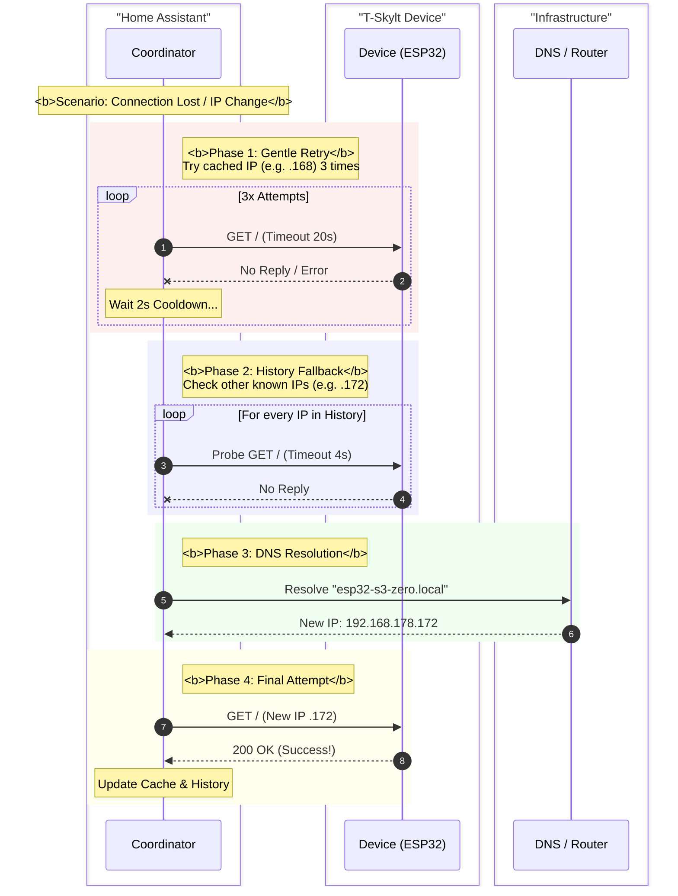

# T-Skylt Departure Board Integration

[](https://github.com/hacs/integration)
[](https://github.com/jnbp/t-skylt/releases)
[](https://github.com/jnbp)

<br>
<p align="center">
  
</p>
<p align="center">
  <b>Control your T-Skylt Sweden AB LED Departure Board directly from Home Assistant.</b>
</p>

---

## 🤖 Transparency Notice
**This integration was created with the assistance of AI.**
I developed this to solve my own need for better control over the board. While the code works well, I am not a professional Python developer. If you find bugs or see room for optimization, **I highly welcome your contributions!** Feel free to open a Pull Request or an Issue.

---

## 📋 Table of Contents
1. [Features](#-features)
2. [Installation](#-installation)
3. [Automation Ideas & Recipes](#-automation-ideas--recipes)
    - [Turn board on based on light and presence sensor](#1-turn-board-on-based-on-light-and-presence-sensor)
    - [The "Infinite Stations" Workaround](#2-the-infinite-stations-workaround-rotation)
4. [Technical Details](#-technical-details)
5. [Credits](#-credits)

---

## 🎛 Features

This integration exposes almost every known function of the board. Below is a complete list of all controls, grouped by their category in Home Assistant.

### 🚉 Category: Station
*Configuration regarding *what* data is shown.*

| Entity / Function | API Parameter | Description |
| :--- | :--- | :--- |
| **Active Config** | `?screen` | Switch between the "Station 1" and "Station 2" internal memory slots. |
| **Country** | `?country` | Select the data provider country (e.g., SE, DE, FI, NO, etc.). |
| **Operator** | `?operator` | Select the specific transport service (e.g., VBB, SL, DB, SJ). |
| **Station ID Input** | `?newstation` | Text field to input the raw Station ID (see "Infinite Stations" below). |
| **Transport Types** | `?type` | Toggle specific transport modes: **Subway**, **Bus**, **Train**, **Tram**, **Ship**. |
| **Max Departures** | `?maxdest` | Dropdown to limit the list to 1-8 departures. |
| **Offset / Hide Within** | `?offset` | Dropdown to hide departures leaving in less than X minutes (0-30 min). |

### 👁 Category: View
*Configuration regarding *how* the data is presented.*

| Entity / Function | API Parameter | Description |
| :--- | :--- | :--- |
| **List Mode** | `?listmode` | Toggle between list view and other layouts. |
| **Clock/Countdown** | `?clocktime` | Toggle between showing the absolute time (e.g., 14:00) or countdown (e.g., 5 min). |
| **Multiple Stops** | `?multiple` | Enable grouping of multiple stops. |
| **Show Station Name** | `?show_station` | Toggle displaying the station name in the header. |
| **Sleep Mode** | `?sleep` | Turn off the display automatically if no departures are available. |
| **Scroll Speed** | `?scroll` | Select text scrolling speed: **Normal** (0) or **Low** (1). |
| **No Departures Text** | `?no_more_departures` | Custom text shown when the board is empty. |
| **Minutes Suffix** | `?mins` | Custom text for the minute abbreviation (e.g., "min"). |

### 📺 Category: Display
*Hardware settings for the LED matrix.*

| Entity / Function | API Parameter | Description |
| :--- | :--- | :--- |
| **Power** | `?onoff` | Turn the display output On or Off. |
| **Brightness** | `?brightness` | Slider to set brightness level (0-2). |
| **LED Tone** | `?color` | Adjust the color temperature: **Orange**, **Yellow**, **White**. |
| **Color Highlight** | `?listcolor` | Enable/Disable colored highlighting of line numbers. |
| **Small Font** | `?fontmini` | Force small font usage. |
| **Line ID Cutoff** | `?line_length` | Trim long line numbers after X characters. |

### ⚙️ Category: System & Configuration
*Maintenance and hardware configuration.*

| Entity / Function | API Parameter | Description |
| :--- | :--- | :--- |
| **Width** | `?width` | Configure matrix width: **XS**, **X**, **XL** (Triggers Reboot). |
| **Rotate** | `/rotate` | Button to flip the display orientation by 180°. |
| **Reboot** | `/stop` | Restarts the device. |
| **Timers** | `?set_timer` | Start/End time fields for every day of the week (Monday - Sunday). |
| **Clear Timers** | `?cleartimer` | Button to delete all active schedules. |
| **TX Power** | `?power` | Adjust the WiFi transmit power (dBm). |
| **E-Mail** | `?user` | Store user email address on the device. |
| **Language** | `?language` | Set system language (English/Swedish). |
| **Update System** | `?update` | Button to trigger an OTA firmware update (only active if update available). |
| **Downgrade** | `?ver` | Button to downgrade firmware to v1.0. |
| **Network Tools** | `/ping` / `/dns` | **Ping Test** and **DNS Info**. |

### 🔍 Sensors & Diagnostics
* **Active IP:** Shows the currently used IP address (useful for dynamic environments).
* **Update Available:** Binary sensor that checks if a new firmware version is detected.
* **System Temperature:** Internal temperature of the ESP/Controller.
* **Uptime:** Time since last reboot in minutes.

---

## 🚀 Installation

### Via HACS
[](https://my.home-assistant.io/redirect/hacs_repository/?owner=jnbp&repository=t-skylt&category=integration)

Use link above or manually add this repo to HACS:

1.  **HACS:** Go to HACS -> Integrations -> 3 dots (top right) -> **Custom repositories**.
2.  **Add URL:** `https://github.com/jnbp/t-skylt` -> Category: **Integration**.
3.  **Install:** Click "Download" on the new card.
4.  **Restart:** Restart Home Assistant.
5.  **Add Device:** Go to Settings -> Devices & Services -> Add Integration -> Search **"T-Skylt"**.
6.  **Setup:** Try the default **Hostname** ("esp32-s3-zero.local") or enter an **IP Address** (e.g., "192.168.1.50") of your board.

---

## 💡 Automation Ideas & Recipes

Here are some ways to get the most out of your board.

### 1. Turn board on based on light and presence sensor

<details>
  <summary>Click to expand YAML code</summary>

```yaml
alias: "Automatisierung: T-Skylt On Off Light Radar"
description: ""
triggers:
  - trigger: state
    entity_id:
      - binary_sensor.kuche_radar_presence_sensor_1
    id: "off"
    to:
      - "off"
      - "on"
  - trigger: state
    entity_id:
      - light.galerie
conditions: []
actions:
  - if:
      - condition: state
        entity_id: light.galerie
        state:
          - "on"
      - condition: numeric_state
        entity_id: light.galerie
        attribute: brightness
        above: 10
      - condition: state
        entity_id: binary_sensor.kuche_radar_presence_sensor_1
        state:
          - "on"
    then:
      - if:
          - condition: state
            entity_id: switch.t_skylt_power
            state:
              - "off"
        then:
          - type: turn_on
            device_id: 834a99bc2f0d346ff6545ed9eaac306e
            entity_id: 399a5859d1908250cc4424e3be4feffe
            domain: switch
    else:
      - if:
          - condition: state
            entity_id: switch.t_skylt_power
            state:
              - "on"
        then: []
      - type: turn_off
        device_id: 834a99bc2f0d346ff6545ed9eaac306e
        entity_id: 399a5859d1908250cc4424e3be4feffe
        domain: switch
mode: single

```

</details>

### 2. The "Infinite Stations" Workaround (Rotation)

<details>

By default, the board supports 2 active stations. This will force you to switch to the small font mode. I was not satisfied by that. Wanted to have the normal font, and the possibility to even show more than two stations.
So I came to the solution to let home assistant **rotate through unlimited stations** by dynamically setting Station IDs via the integration.

#### ⚠️ Prerequisite: The "Warm-Up"

The board seems to cache station metadata locally. Before using a Station ID in Home Assistant, you **must** search for it **once manually** on the device's web interface (`http://<YOUR-IP>/`).

1. Open the board's IP in your browser.
2. Manually search and select the station you want to use.
3. Once the board has "seen" the station once, you can control it via Home Assistant.

#### How to find Station IDs

To use the automation, you need the raw Station IDs.
You can either track them in your developer mode directly on your browser or get them from somewhere else. For example for VBB (Berlin-Brandenburg) you can find a list of all stations here: [VBB Stations List](https://derhuerst.github.io/vbb-stations-html/).

In case you are using the VBB list, you need to be adjust the station id by **removing two zeros**.

* Change this: `900000100003`
* to this: `9000100003`

I have not yet verified the ID formats for other operators (DB, SJ, etc.). If you figure out the logic, feel free to share your insights!

#### The Automation Code

Use an automation that changes the `text.t_skylt_station_id_input` every few seconds to cycle through your favorite stops.

<details>
<summary>Click to expand YAML code</summary>

```yaml
alias: "Automatisierung: T-Skylt Station Switch"
description: ""
triggers:
  - trigger: state
    entity_id:
      - switch.t_skylt_power
    to:
      - "on"
    from:
      - "off"
conditions: []
actions:
  - device_id: 834a99bc2f0d346ff6545ed9eaac306e
    domain: select
    entity_id: aa57bd7c40f1d6e51823624569cf1368
    type: select_option
    option: Station 1
    enabled: false
  - repeat:
      while:
        - condition: state
          entity_id: switch.t_skylt_power
          state:
            - "on"
      sequence:
        - device_id: 834a99bc2f0d346ff6545ed9eaac306e
          domain: text
          entity_id: 952269e600452676018d385b25e2810a
          type: set_value
          value: "9000100003"
        - delay:
            hours: 0
            minutes: 0
            seconds: 10
            milliseconds: 0
        - device_id: 834a99bc2f0d346ff6545ed9eaac306e
          domain: text
          entity_id: 952269e600452676018d385b25e2810a
          type: set_value
          value: "9000003201"
        - delay:
            hours: 0
            minutes: 0
            seconds: 10
            milliseconds: 0
        - device_id: 834a99bc2f0d346ff6545ed9eaac306e
          domain: text
          entity_id: 952269e600452676018d385b25e2810a
          type: set_value
          value: "9000100020"
        - delay:
            hours: 0
            minutes: 0
            seconds: 10
            milliseconds: 0
mode: single

```

</details>
</details>

---

## 🧠 Technical Details

<details>

This integration includes sophisticated logic to handle unstable networks (e.g., WiFi Repeaters) and the specific limitations of the ESP32 hardware.

### ⚙️ How it works: Web Scraping & Polling

The T-Skylt board does not provide a formal JSON API. Instead, this integration acts like a web browser:

1. **Fetching:** It performs an HTTP GET request to the device's root URL (`/`) to retrieve the raw HTML.
2. **Parsing:** It uses `BeautifulSoup` to parse the HTML structure.
3. **Controlling:** To change settings, the integration sends HTTP requests with query parameters (e.g., `/?brightness=2`).

### 🛡️ Robust Connectivity Strategy ("Defense in Depth")

A major challenge with IoT devices in home networks is stability. WiFi signals fluctuate, Repeaters change IP addresses dynamically, and microcontrollers can be temporarily busy. To prevent the device from flickering to "Unavailable" in Home Assistant, this integration implements a **4-Phase Connection Logic**.

We don't just give up on the first error. We fight to keep the connection alive.

#### The 4 Phases of Connection

1. **Phase 1: Gentle Retry (Anti-Flicker)**
* We try the last known IP address up to **3 times**.
* Between attempts, we wait **2 seconds**.
* *Why?* This catches 90% of issues where the device is just busy rebooting or the WiFi has a short hiccup.


2. **Phase 2: History Check (Repeater Logic)**
* If Phase 1 fails, we assume the IP might have changed (e.g., Repeater switch).
* We check an internal **History List** of the last 5 known working IPs.
* We probe them with a very fast timeout (4s). If one answers, we switch immediately without waiting for DNS.


3. **Phase 3: DNS Resolution (Last Resort)**
* If history is empty/dead, we ask the network (mDNS) for the current IP of the hostname.


4. **Phase 4: Final Attempt**
* We try the new IP from Phase 3 with a full timeout.


<details>
<summary><b>🔍 Click to view Sequence Diagram</b></summary>



</details>

### 🛡️ Concurrency Control (The Queue)

The ESP32 is single-threaded. To prevent crashing the web server:

* **Async Locking:** An `asyncio.Lock` ensures that Home Assistant never sends two requests at the same time.
* **Socket Cleanup:** Every request sends `Connection: close` to free up memory on the device immediately.

</details>

---

## ❤️ Credits

A massive thank you to **T-Skylt Sweden AB**!
The collaboration with the manufacturer is quite cool, and their support allowed me to add some additional stuff to this integration.

* **Hardware Manufacturer:** [T-Skylt Sweden AB](http://t-skylt.se)
* **Integration Maintainer:** [@jnbp](https://github.com/jnbp)

```

```
